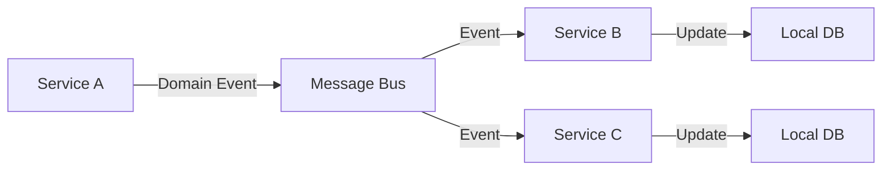
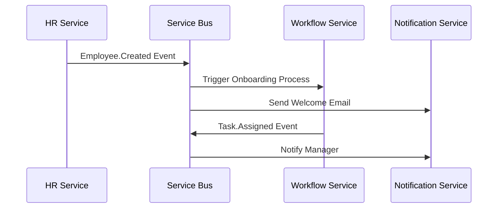
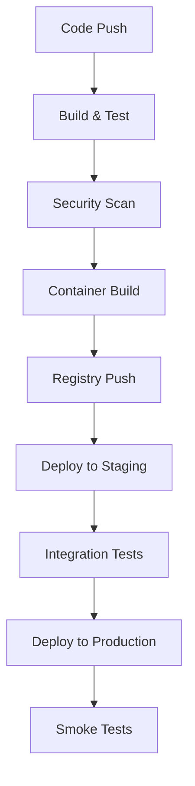

# ERP Management System - Architecture Documentation

## Table of Contents
1. [System Overview](#system-overview)
2. [Architecture Principles](#architecture-principles)
3. [Technology Stack](#technology-stack)
4. [Service Architecture](#service-architecture)
5. [Database Strategy](#database-strategy)
6. [Communication Patterns](#communication-patterns)
7. [Security Architecture](#security-architecture)
8. [Deployment Architecture](#deployment-architecture)
9. [Monitoring and Observability](#monitoring-and-observability)
10. [Scalability and Performance](#scalability-and-performance)

## System Overview

The ERP Management System is a cloud-native, microservices-based enterprise resource planning solution designed for scalability, maintainability, and high availability. The system follows Domain-Driven Design (DDD) principles and implements a polyglot architecture to leverage the best technologies for specific business domains.

### Key Characteristics
- **Microservices Architecture** - Loosely coupled, independently deployable services
- **Polyglot Programming** - Multiple programming languages optimized for specific domains
- **Cloud-Native** - Designed for Azure cloud platform with containerization
- **Event-Driven** - Asynchronous communication through events and messaging
- **Domain-Driven Design** - Business logic organized around domain boundaries

## Architecture Principles

### 1. Single Responsibility Principle
Each microservice has a single, well-defined business responsibility:
- HR Service: Human resources management
- Inventory Service: Stock and warehouse management
- Accounting Service: Financial operations
- Workflow Service: Business process automation
- Notification Service: Communication and alerts

### 2. Database per Service
Each service owns its data and database schema:
- **SQL Server** for transactional services (HR, Inventory, Accounting, Workflow)
- **MongoDB** for document-based services (Notification)
- No direct database access between services
- Data consistency through eventual consistency patterns

### 3. API-First Design
- RESTful APIs with OpenAPI specifications
- Versioned APIs for backward compatibility
- Consistent API patterns across services
- API Gateway for unified access

### 4. Fault Tolerance
- Circuit breaker patterns
- Retry mechanisms with exponential backoff
- Graceful degradation
- Health checks and monitoring

## Technology Stack

### Core Services (.NET 10)
```
├── HR Service
├── Inventory Service
└── Accounting Service
    ├── Domain Layer (C#)
    ├── Application Layer (MediatR, FluentValidation)
    ├── Infrastructure Layer (Entity Framework Core)
    └── API Layer (ASP.NET Core Web API)
```

### Supporting Services
- **Workflow Service**: Java 21 with Spring Boot and Flowable BPM
- **Notification Service**: Node.js 18 with Express.js and Socket.IO

### Cloud Infrastructure
- **Azure Kubernetes Service (AKS)** - Container orchestration
- **Azure Service Bus** - Asynchronous messaging
- **Azure API Management** - API gateway and management
- **Azure Key Vault** - Secret management
- **Azure Monitor/Application Insights** - Observability

## Service Architecture

### Domain-Driven Design Implementation

Each .NET service follows DDD architecture:

```
Service/
├── Domain/
│   ├── Entities/          # Domain entities and aggregates
│   ├── ValueObjects/      # Value objects
│   ├── DomainEvents/      # Domain events
│   ├── Repositories/      # Repository interfaces
│   └── Services/          # Domain services
├── Application/
│   ├── Commands/          # Command handlers (CQRS)
│   ├── Queries/           # Query handlers (CQRS)
│   ├── DTOs/             # Data transfer objects
│   ├── Validators/        # Input validation
│   └── Services/          # Application services
├── Infrastructure/
│   ├── Data/             # Entity Framework context
│   ├── Repositories/     # Repository implementations
│   ├── External/         # External service integrations
│   └── Configuration/    # Infrastructure configuration
└── API/
    ├── Controllers/      # REST API controllers
    ├── Middleware/       # Custom middleware
    └── Configuration/    # API configuration
```

### Service Boundaries

#### HR Service
**Domain**: Employee lifecycle management
**Responsibilities**:
- Employee information management
- Payroll processing
- Leave management
- Performance tracking

#### Inventory Service
**Domain**: Stock and supply chain management
**Responsibilities**:
- Product catalog management
- Inventory tracking
- Warehouse management
- Supplier relationships

#### Accounting Service
**Domain**: Financial operations
**Responsibilities**:
- General ledger
- Accounts payable/receivable
- Financial reporting
- Tax management

#### Workflow Service
**Domain**: Business process automation
**Responsibilities**:
- Process definition and execution
- Task management
- Approval workflows
- Process monitoring

#### Notification Service
**Domain**: Communication and alerts
**Responsibilities**:
- Real-time notifications
- Email delivery
- SMS messaging
- Push notifications

## Database Strategy

### Per-Service Database Pattern

Each service maintains its own database to ensure:
- Service autonomy
- Independent scaling
- Technology flexibility
- Fault isolation

### Database Technologies

#### SQL Server (Relational Data)
**Services**: HR, Inventory, Accounting, Workflow
**Use Cases**:
- Transactional data
- Complex relationships
- ACID compliance
- Reporting queries

**Schema Design**:
- Normalized schemas for data integrity
- Soft delete for audit trails
- Optimistic concurrency control
- Database migrations with Entity Framework

#### MongoDB (Document Data)
**Service**: Notification
**Use Cases**:
- Flexible schema for different notification types
- High write throughput
- Horizontal scaling
- Real-time data

### Data Consistency Strategies

#### Eventual Consistency
- Primary pattern for cross-service data
- Event-driven synchronization
- Compensating actions for failures

#### Strong Consistency
- Within service boundaries
- Database transactions
- Domain event handling

#### Data Synchronization


## Communication Patterns

### Synchronous Communication
**Pattern**: HTTP/REST APIs
**Use Cases**:
- Real-time queries
- User-initiated operations
- Data validation

**Implementation**:
- RESTful APIs with OpenAPI specifications
- JWT authentication
- API Gateway routing
- Load balancing

### Asynchronous Communication
**Pattern**: Event-driven messaging
**Use Cases**:
- Domain events
- Data synchronization
- Background processing

**Implementation**:
- Azure Service Bus topics and subscriptions
- Domain events with MediatR
- Message serialization with JSON
- Dead letter queues for failed messages

### Message Flow Example


## Security Architecture

### Authentication and Authorization

#### Identity Provider Integration
- Azure Active Directory B2C
- JWT token-based authentication
- Role-based access control (RBAC)
- Multi-factor authentication support

#### API Security
- OAuth 2.0 / OpenID Connect
- API key authentication for service-to-service
- Rate limiting and throttling
- Input validation and sanitization

### Inter-Service Communication Security

#### Mutual TLS (mTLS)
- Certificate-based authentication
- Encrypted communication channels
- Certificate rotation automation
- Service mesh integration (Istio/Linkerd)

#### Network Security
- Virtual network isolation
- Network security groups
- Private endpoints for Azure services
- Web Application Firewall (WAF)

### Data Protection

#### Encryption
- Encryption at rest (Azure Storage Service Encryption)
- Encryption in transit (TLS 1.3)
- Key management with Azure Key Vault
- Field-level encryption for sensitive data

#### Compliance
- GDPR compliance measures
- SOX compliance for financial data
- Audit logging for all operations
- Data retention policies

## Deployment Architecture

### Containerization Strategy

#### Docker Containers
- Multi-stage builds for optimization
- Distroless base images for security
- Health check endpoints
- Resource limits and requests

#### Container Registry
- Azure Container Registry (ACR)
- Image vulnerability scanning
- Image signing and verification
- Automated image builds

### Kubernetes Deployment

#### Azure Kubernetes Service (AKS)
```yaml
Cluster Configuration:
├── Node Pools
│   ├── System Pool (3 nodes, Standard_D2s_v3)
│   └── User Pool (Auto-scaling 1-10 nodes)
├── Network Configuration
│   ├── Azure CNI networking
│   ├── Network policies
│   └── Private cluster endpoint
└── Add-ons
    ├── Azure Key Vault Provider
    ├── Azure Policy
    └── Azure Monitor
```

#### Service Mesh
- **Istio** for advanced traffic management
- **Linkerd** for lightweight service mesh
- **Features**:
  - Traffic splitting and canary deployments
  - Mutual TLS automation
  - Observability and tracing
  - Circuit breaking and retries

### Infrastructure as Code

#### Azure Bicep Templates
- Declarative infrastructure definitions
- Parameterized templates for environments
- Resource dependency management
- Template validation and testing

#### Terraform Configuration
- Multi-cloud compatibility
- State management with Azure Storage
- Module-based organization
- Automated plan and apply

#### Helm Charts
- Kubernetes application packaging
- Environment-specific value files
- Dependency management
- Release management

### CI/CD Pipeline

#### GitHub Actions Workflow


#### Pipeline Features
- Multi-language build support
- Parallel testing execution
- Automated security scanning
- Blue-green deployments
- Rollback capabilities

## Monitoring and Observability

### Three Pillars of Observability

#### Metrics
**Collection**: Azure Monitor, Prometheus
**Visualization**: Grafana, Azure Dashboards
**Key Metrics**:
- Service response times
- Error rates
- Resource utilization
- Business metrics

#### Logging
**Framework**: Serilog (.NET), Winston (Node.js), Logback (Java)
**Aggregation**: Azure Monitor Logs
**Structure**:
- Structured logging with correlation IDs
- Centralized log collection
- Log retention policies
- Search and alerting

#### Tracing
**Implementation**: Application Insights, OpenTelemetry
**Features**:
- Distributed tracing across services
- Request correlation
- Performance bottleneck identification
- Dependency mapping

### Health Monitoring

#### Health Checks
```csharp
// .NET Health Check Example
services.AddHealthChecks()
    .AddEntityFrameworkCoreCheck<HRDbContext>()
    .AddAzureServiceBusQueue("queue-name")
    .AddApplicationInsightsPublisher();
```

#### Alerting Strategy
- **Critical**: Service unavailability, data corruption
- **Warning**: High latency, resource constraints
- **Information**: Deployment status, business events

### Performance Monitoring

#### Application Performance Monitoring (APM)
- Real-time performance metrics
- Slow query detection
- Memory leak identification
- Dependency performance tracking

#### Business Intelligence
- Custom business metrics
- Real-time dashboards
- Trend analysis
- Capacity planning

## Scalability and Performance

### Horizontal Scaling

#### Kubernetes Horizontal Pod Autoscaler (HPA)
```yaml
apiVersion: autoscaling/v2
kind: HorizontalPodAutoscaler
metadata:
  name: hrservice-hpa
spec:
  scaleTargetRef:
    apiVersion: apps/v1
    kind: Deployment
    name: hrservice
  minReplicas: 2
  maxReplicas: 10
  metrics:
  - type: Resource
    resource:
      name: cpu
      target:
        type: Utilization
        averageUtilization: 70
```

#### Database Scaling
- **Read Replicas**: For read-heavy workloads
- **Sharding**: For large datasets
- **Connection Pooling**: Efficient connection management
- **Caching**: Redis for frequently accessed data

### Performance Optimization

#### Caching Strategy
- **Application-Level**: In-memory caching with IMemoryCache
- **Distributed**: Redis for shared cache
- **CDN**: Azure CDN for static content
- **Database**: Query result caching

#### Asynchronous Processing
- **Background Jobs**: Hangfire for .NET services
- **Message Queues**: Azure Service Bus for decoupling
- **Event Processing**: Event sourcing for audit trails

### Load Testing and Capacity Planning

#### Load Testing Tools
- **k6** for API load testing
- **Artillery** for real-time scenarios
- **Azure Load Testing** for cloud-scale testing

#### Capacity Planning
- Resource usage trending
- Peak load analysis
- Cost optimization
- Auto-scaling configuration

## Disaster Recovery and Business Continuity

### Backup Strategy
- **Database Backups**: Automated daily backups with point-in-time recovery
- **Configuration Backups**: Infrastructure and application configuration
- **Code Repository**: Distributed version control with GitHub

### High Availability
- **Multi-Region Deployment**: Active-passive configuration
- **Service Redundancy**: Multiple instances per service
- **Database Clustering**: Always On availability groups
- **Health Monitoring**: Automated failover triggers

### Recovery Procedures
- **RTO (Recovery Time Objective)**: 4 hours for critical services
- **RPO (Recovery Point Objective)**: 1 hour maximum data loss
- **Backup Testing**: Monthly restore procedures
- **Documentation**: Detailed runbooks and procedures

## Compliance and Governance

### Regulatory Compliance
- **SOX Compliance**: Financial data controls and audit trails
- **GDPR Compliance**: Data privacy and protection measures
- **Industry Standards**: ISO 27001, SOC 2 Type II

### Data Governance
- Data classification and labeling
- Access controls and permissions
- Data retention and deletion policies
- Privacy by design principles

### Security Governance
- Security scanning in CI/CD pipeline
- Vulnerability assessment and remediation
- Security incident response procedures
- Regular security training and awareness

## Future Roadmap

### Phase 1 (Current): Foundation
- Core service implementation
- Basic CI/CD pipeline
- Essential monitoring

### Phase 2 (Next 6 months): Enhancement
- Advanced analytics and reporting
- Mobile applications
- Enhanced security features
- Performance optimization

### Phase 3 (12+ months): Innovation
- Machine learning integration
- IoT device support
- Advanced automation
- Multi-tenant architecture

---

This architecture documentation serves as the foundation for the ERP Management System. It should be updated as the system evolves and new requirements emerge.
